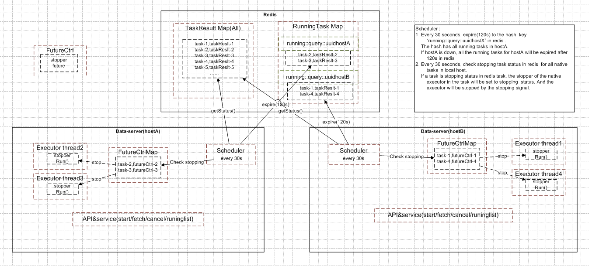

# Redis HA demo with stateful async future

## 1. Dev Guide
### 1.1 Modify config

Need to modify "redis address" in application.properties:

```
spring.redis.host=192.168.2.93
```

### 1.2 Swagger Access url

localhost deploy:

```
http://localhost:8080/swagger-ui.html
```

k8s deploy ( k8s/async-deployment.yaml and k8s/async-service.yaml ):

```
http://<nodeIP>:30080/swagger-ui.html
```

### 1.3 Curl Access to APIs

start:

```
curl -X POST "http://192.168.2.94:30080/redis/task/start?alivetime=600" -H  "accept: application/json"
```

fetch:

```
curl -X POST "http://192.168.2.94:30080/redis/task/fetch?taskId=task-async-deployment-79bf9766d-pntqc-10.100.190.112-0" -H  "accept: application/json"
```

list running:

```
curl -X POST "http://192.168.2.94:30080/redis/task/list" -H  "accept: application/json"
```

cancel:

```
curl -X POST "http://192.168.2.94:30080/redis/task/cancel?taskId=task-async-deployment-79bf9766d-pntqc-10.100.190.112-1" -H  "accept: application/json"
```

## 2. Design

### 2.1 Sync Up Scheduler

It keeps taskResult sync up in redis with in local memory.



### 2.2 PAI Process

a) API start :
1. generate a task uuid and create a taskResult
2. start an sync task to execute task with a stopper param
3. put taskResult to taskResult Map redis cache
4. put taskResult to running task Map redis cache
5. put futureCtrl with stopper to FutureCtrl Map local cache
6. return uuid to caller

b) API fetch :
1. get taskResult by taskid from taskResult Map redis
2. if running status, check whether exist in running task list in redis to void the host with this task was down.
3. if the host with this task is alive , return the taskResult, 
4. otherwise, return null or throw exception

c) API running list :
1. return taskResult list from running task map redis

d) API cancel :
1. set task status to stopping in taskResult Map redis cache
2. remove the task in running task map redis cache
3. return success
4. Every 30 seconds,  local scheduler checks every native task status on redis, if the task is set to stopping status on redis, then set native executor.stopper to stopping signal.
5. executor will stop if receive stopping signal  for this task 

